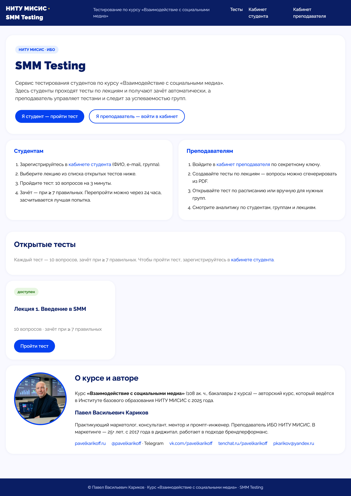

# SMM_testing — система автоматизированного тестирования студентов

> Итоговый проект курса **«Вайбкодинг. Профессия»** (Claude Code).
> Автор: Павел Кофф (pavelkoff), НИТУ МИСИС, курс «Взаимодействие с социальными медиа».

<p align="center">
  
</p>

> Живое демо: **https://smm-testing.onrender.com** (Render free, холодный старт —
> откройте за 1–2 мин до показа и дождитесь загрузки главной).

## Назначение

Веб-ресурс для автоматизации прохождения тестов студентами после каждой темы (лекции). Студент регистрируется, проходит тест из 10 вопросов, получает зачёт/незачёт. Преподаватель видит сводную таблицу прогресса и итоговый допуск к финальному зачёту по курсу.

## Цели и задачи

- **Для студента:** удобная веб-форма прохождения теста по конкретной лекции с мгновенным результатом.
- **Для преподавателя:** автоматический учёт регистраций, результатов, ошибок по вопросам и итоговый допуск к зачету — без ручной проверки.

## Критерий зачёта

- **Зачёт** — **7 и более** правильных ответов из 10 (незачёт — 6 и менее).
- Порог (7) и количество вопросов (10) вынесены в конфиг (`config.py`) — можно менять без правки логики.

## Структура вопросов (10 шт. на тест)

| Сложность | Количество | Назначение |
|---|---|---|
| Лёгкие | **4** | Базовое понимание темы, фактология |
| Средние | **4** | Применение знаний, анализ кейсов |
| На смекалку и логику | **2** | Нестандартное применение, рассуждение |

- Структура (4 / 4 / 2) фиксируется в конфиге и валидируется при загрузке JSON-файла теста.
- Формат JSON-вопроса включает поле `difficulty: easy | medium | logic`.
- *Опционально:* в кабинете преподавателя можно видеть результаты по уровням сложности (где чаще ошибаются).

## Курс и расписание

- На курсе **9 лекций** → **9 тестов** (по одному на лекцию).
- Преподаватель читает лекции по расписанию. После того как лекция прочитана всем студентам курса, **открывается доступ** к тесту по этой лекции.
- **Жизненный цикл теста**:
  - `draft` — тест создан (из PDF или JSON), скрыт от студентов;
  - `scheduled` — задано время открытия, доступ откроется автоматически;
  - `open` — тест доступен студентам;
  - `closed` — приём ответов окончен.

## Критерий допуска к финальному зачёту

Студент **«допущен»** к финальному зачёту по курсу при выполнении **обоих** условий:
1. **Прошёл все 9 тестов** (по каждой лекции).
2. **Набрал минимум 81 правильный ответ из 90** суммарно по всем тестам (≈ 90 %).

Иначе — **«не допущен»**. Порог (81 из 90) вынесен в конфиг.

## Сценарий работы

### Преподаватель — создание теста из презентации
1. Преподаватель открывает **кабинет преподавателя** (защищённый доступ).
2. Загружает **презентацию лекции в формате PDF**.
3. Система извлекает текст из PDF и **генерирует тест через внешнюю LLM (GPT-4o-mini, OpenAI SDK)**: 10 вопросов в пропорции **4 лёгких / 4 средних / 2 на смекалку и логику**, с правильными ответами.
   - **Гибридный режим:** можно загрузить PDF для автогенерации либо загрузить готовый JSON-файл теста.
4. Тест сохраняется в статусе `draft`, преподаватель видит предпросмотр вопросов.
5. Преподаватель проверяет и **публикует** тест, выбрав способ открытия:
   - **вручную кнопкой** («Открыть доступ») → `open`;
   - **по расписанию** (дата/время) → `scheduled`, доступ откроется автоматически.

### Студент
1. Открывает сайт → видит список тестов по лекциям (доступны только `open` или тесты с наступившим временем `scheduled`).
2. Выбирает тест → регистрируется: **имя, фамилия, группа, корпоративная почта @misis.ru**.
3. Проходит тест (10 вопросов), отправляет ответы.
4. Система проверяет ответы и выставляет оценку (зачёт при **7 из 10**, иначе незачёт).
5. Студент видит результат и количество правильных ответов.
   - **Копия результата отправляется e-mail'ом от имени преподавателя** на корпоративную почту студента (@misis.ru) — см. раздел «Email-уведомления».

### Преподаватель — мониторинг
1. В **кабинете** видит **сводную таблицу** по всем попыткам:
   - студент (имя, фамилия, группа);
   - какой тест прошёл, оценка (зачёт / незачёт);
   - **на какие вопросы ответил неверно** (номер, сложность, правильный ответ).
2. Видит **итоговую таблицу допуска** по каждому студенту:
   - прогресс по всем 9 тестам (пройдено / зачтено / суммарно правильных);
   - статус **«допущен / не допущен»** к финальному зачёту (все 9 + 81 из 90).

## Email-уведомления

- После прохождения теста результат отправляется **от имени преподавателя** на **корпоративную почту студента (@misis.ru)**.
- Письмо содержит: название теста (лекция), количество правильных ответов из 10, оценку (зачёт / незачёт), перечень вопросов, на которые студент ответил неверно, с правильными ответами.
- Отправка через **Яндекс SMTP** (`smtp.yandex.ru`, порт 465 SSL / 587 STARTTLS) с ящика преподавателя **pkarikov@yandex.ru** (требуется пароль приложения Яндекс). Настройки в `.env`: `SMTP_HOST`, `SMTP_PORT`, `SMTP_USER`, `SMTP_PASSWORD`, `SMTP_FROM_NAME`.
- **Плановый переход:** корпоративный ящик `karikov.pv@misis.ru` откроют в **феврале 2027** (после переподписания договора с МИСИС). До этого отправка идёт с Яндекса; адрес отправителя вынесен в конфиг — переключение займёт одну переменную в `.env`.
- При регистрации студент указывает почту `@misis.ru`; система **проверяет домен** (только корпоративные адреса).
- **Отказоустойчивость:** отправка включается флагом `SMTP_ENABLED=1` (по умолчанию `0` — письмо не отправляется, результат виден в кабинете). При недоступности/ошибке SMTP результат всё равно показывается студенту — email-канал не критичный, ошибка логируется. Реализация — `app/services/emailer.py`, вызов из `submit_test` в потоке (`asyncio.to_thread`, не блокирует event loop).

## Стек технологий

| Слой | Технология | Обоснование |
|---|---|---|
| Backend | **Python + FastAPI** | Современный фреймворк, автодокументация (`/docs`), асинхронность, подходит для итогового проекта |
| База данных | **SQLite + SQLAlchemy ORM** | Файл без отдельного сервера, портативность, ORM упрощает запросы преподавателя |
| Фронтенд | **Jinja2 + HTML/CSS** (server-rendered) | Один проект без сборки SPA; результат виден сразу |
| Генерация тестов | **OpenAI SDK + GPT-4o-mini** | Внешняя LLM создаёт 10 вопросов 4/4/2 из текста презентации; дешёвая и быстрая модель |
| Парсинг PDF | **pdfplumber** | Извлечение текста слайдов из загруженной презентации |
| Вопросы тестов | **JSON-файлы по лекциям** | Преподаватель правит вопросы в тексте, без админки БД |
| Расписание доступа | **APScheduler** | Автоматическое открытие тестов в заданное время (`scheduled` → `open`) |
| Email-отправка | **smtplib + email.mime** (SMTP) | Доставка результатов студентам на @misis.ru от имени преподавателя |
| Запуск (локально) | **Uvicorn** | Стандартный ASGI-сервер для FastAPI |

> Альтернативы рассматривались: Flask (проще, но менее «показный» для диплома), PostgreSQL (мощнее, но избыточен для одной группы), React-фронт (отдельная сборка, оверхед для теста из 10 вопросов). Для генерации тестов рассматривалась Anthropic Claude API, но выбран GPT-4o-mini как сторонняя LLM по требованию задачи.

## Структура проекта (планируемая)

```
SMM_testing/
├── README.md                  # этот файл
├── requirements.txt           # зависимости Python
├── .env.example               # шаблон переменных окружения (API-ключ OpenAI и др.)
├── config.py                  # настройки (порог зачёта, 4/4/2, допуск 81/90, доступ преподавателя)
├── app/
│   ├── main.py                # точка входа FastAPI
│   ├── database.py            # подключение SQLite, сессии SQLAlchemy
│   ├── models.py              # модели: Student, Test, Question, Attempt, Answer
│   ├── auth.py                # защита кабинета преподавателя (пароль / токен)
│   ├── routers/
│   │   ├── student.py         # роуты студента: список тестов, регистрация, прохождение
│   │   └── teacher.py         # роуты преподавателя: загрузка PDF, публикация, аналитика, допуск
│   ├── services/
│   │   ├── pdf_parser.py      # извлечение текста из PDF (pdfplumber)
│   │   ├── ai_generation.py   # генерация теста через OpenAI GPT-4o-mini
│   │   ├── questions.py       # загрузка/валидация JSON-вопросов (4/4/2)
│   │   ├── grading.py         # проверка ответов и выставление оценки (7 из 10)
│   │   ├── scheduler.py       # APScheduler: открытие тестов по расписанию
│   │   ├── emailer.py         # отправка результатов студенту на @misis.ru (SMTP)
│   │   └── admission.py       # логика итогового допуска к зачёту (все 9 + 81/90)
│   └── templates/             # Jinja2-шаблоны (список тестов, форма, результат, кабинет)
├── uploads/                   # загруженные PDF-презентации
├── tests_data/                # JSON-файлы с вопросами по лекциям
│   └── lecture_01.json
└── data/
    └── smm_testing.db         # файл SQLite (создаётся при первом запуске)
```

## Модели данных (планируемые)

- **Student** — `id`, `first_name`, `last_name`, `group`, `email` (@misis.ru), `created_at`.
- **Test** — `id`, `lecture_title`, `status` (draft/scheduled/open/closed), `scheduled_at`, `source` (pdf/json), `pdf_path`, `pass_threshold`, `created_at`.
- **Question** — `id`, `test_id`, `number`, `difficulty` (easy/medium/logic), `text`, `options`, `correct_answer`.
- **Attempt** — `id`, `student_id`, `test_id`, `score`, `passed` (bool), `started_at`, `finished_at`.
- **Answer** — `id`, `attempt_id`, `question_number`, `difficulty`, `student_answer`, `is_correct`.

## Запуск локально

```bash
cd SMM_testing
python3 -m venv venv
source venv/bin/activate            # Windows: venv\Scripts\activate
pip install -r requirements.txt
cp .env.example .env                # заполнить OpenAI/SMTP/пароль преподавателя
uvicorn app.main:app --reload       # http://127.0.0.1:8000  (документация: /docs)
```

## Развитие сервиса

Проект создавался под курс SMM МИСИС, но архитектура намеренно курсо-независимая — это база для дальнейшего роста.

- **Боевой запуск — февраль 2027** (перед весенним семестром 2026-2027 уч. г.). На этом этапе планируется:
  - **Подключение реальных корпоративных почт.** Сейчас SMTP-ящик преподавателя — `pkarikov@yandex.ru` (Яндекс SMTP, пароль приложения); с февраля 2027 переводится на корпоративный `karikov.pv@misis.ru`. Для студентов — включение верификации владения ящиком `@misis.ru` (инфраструктура SMTP уже заложена в `app/services/emailer.py`, сейчас регистрация по домену без подтверждения) и сквозная отправка результатов тестов на корпоративные адреса.
  - Переход с демо-деплоя (Render free, мок-режим AI, эфемерный диск) на полноценный VPS с постоянной БД и реальным вызовом GPT-4o-mini (`AI_MOCK=0`).
  - **Нагрузочное тестирование.** Демо работает на одном воркере Render free; боевой запуск должен уверенно держать поток **от 100 студентов и выше** (одновременная сдача теста группой). Планируется: профилирование узких мест (SQLite под конкурентной записью → при необходимости переход на PostgreSQL), горизонтальное масштабирование (несколько воркеров за балансировщиком, вынос статических файлов), нагрузочный прогон (locust/wrk) с целевым RPS и контролем latency/ошибок при пиковой нагрузке.
  - **Индивидуальный набор вопросов для каждого студента (анти-списывание).** Сейчас все студенты одной лекции получают одинаковые 10 вопросов — это позволяет передать правильные ответы между студентами. Цель — чтобы у каждого студента был свой набор. Направление решения: банк вопросов по каждой лекции (заметно больше 10, сгенерированных заранее и прошедших QA), из которого при старте попытки случайным образом выбирается 10 под конкретного студента; дополнительно — перемешивание порядка вопросов и порядка вариантов ответов. Так у соседей совпадают лишь отдельные вопросы, а «правильные ответы» одного студента бесполезны другому.
  - **Защита от использования LLM при тестировании.** Запретить студенту «прогнать» вопросы через ChatGPT/поиск во время теста — открытая задача (полностью это не решается технически). Комплекс мер: жёсткий тайм-лимит уже есть (3 мин на тест — окно слишком короткое для развёрнутого копирования в LLM); поток по одному вопросу (экран всегда показывает только текущий вопрос); вопросы на анализ/логику/кейсы вместо чистой фактологии (LLM отвечает хуже, где нужен контекст конкретной лекции); серверный контроль времени и попыток; на исследование — лёгкий прокторинг (мониторинг потери фокуса вкладки/переключения вкладок, запрет copy-paste в форме) и метрики «слишком быстрого» или «идеально-быстрого» ответа.
- **Адаптация под любой курс университета.** Сервис не привязан к тематике SMM: лекция = единица учебного материала, тест = 10 вопросов 4/4/2 по этой лекции. Чтобы запустить тестирование по другому курсу, достаточно: загрузить свои PDF-презентации (или JSON-тесты), задать число тестов и пороги в `config.py` (`ADMISSION_TESTS_REQUIRED`, `ADMISSION_CORRECT_REQUIRED`, `PASS_THRESHOLD`), указать домен почты студентов (`STUDENT_EMAIL_DOMAIN`) и свои SMTP-реквизиты. Применимо для любой дисциплины, где нужно объективно проверить усвоение материала по итогам прохождения учебного материала.

## Лицензия

Проект распространяется под лицензией **MIT** — см. файл [LICENSE](LICENSE). Свободно используйте, модифицируйте и адаптируйте под свои учебные курсы.